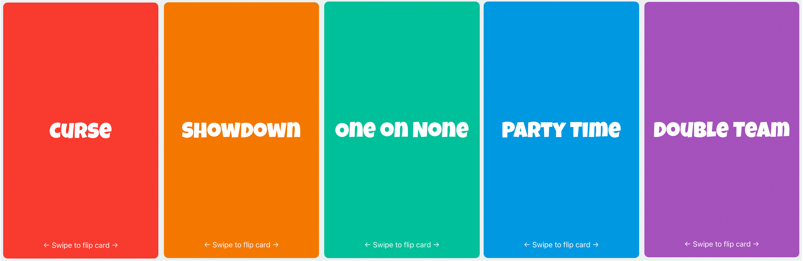

# Gamma Games

> As this project is in active development, I am unable to post the source code publicly.
> If you would like to take a look at the source code for Gamma, please [email me](mbrand@stevens.edu).

Gamma is a first-of-its-kind gaming platform for iOS. Gamma allows card games to be easily adapted to iOS. Our goal is to be the go-to app for iPhone card games. We have designed an interactive GUI emulating a realistic deck of cards, which allows our interface to be simple yet feel natural to players. We developed a packaging system for games which allows games to be easily ported to Gamma with a custom JSON file and card graphics. A live multiplayer system using websockets to connect multiple iPhones is currently in development. We are working with multiple partners who are building high quality games for Gamma. From educational games for children, to social games for teens, to trivia games for adults, we aspire to build a card game for everyone.

A game currently being built
(rear side of cards)
